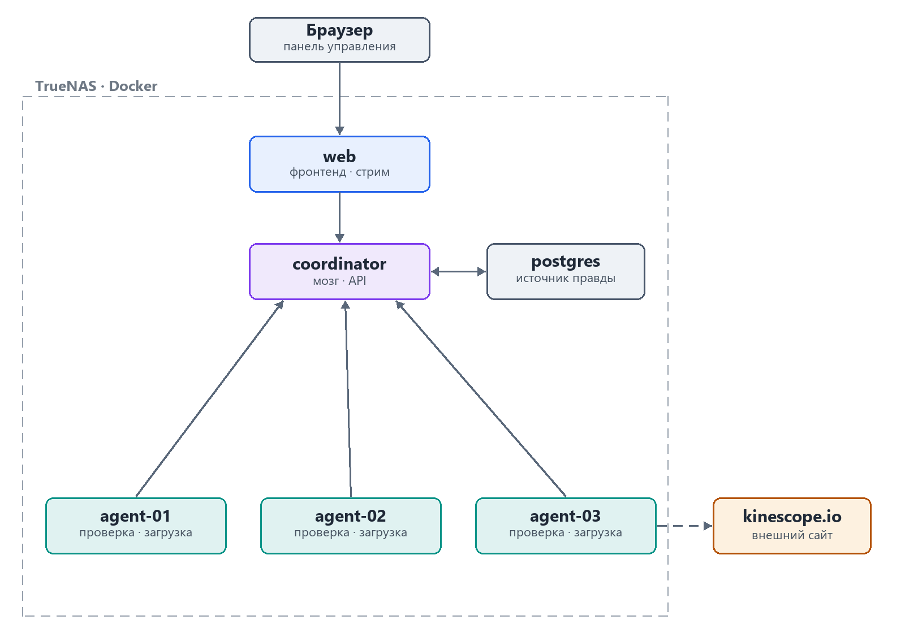

# Vidhive

**Распределённая система обнаружения и загрузки видеоматериалов.**

Vidhive обходит заданный диапазон числовых идентификаторов на внешнем ресурсе
`kinescope.io/{id}`, проверяет наличие доступного к скачиванию видео, извлекает
метаданные и загружает файл в лучшем доступном качестве. Работа распределяется
между несколькими рабочими серверами (агентами), а управление и мониторинг
выполняются через централизованный веб-интерфейс.

Учебный проект (лабораторная работа №1). Полное техническое описание —
в [docs/Проектная_документация.docx](docs/Проектная_документация.docx).

## Архитектура

Система разворачивается как пять Docker-контейнеров. «Голова» (координатор с
веб-интерфейсом + БД) существует в единственном экземпляре; рабочих агентов
может быть сколько угодно.



| Компонент     | Роль                                                                 |
|---------------|----------------------------------------------------------------------|
| `coordinator` | Мозг + веб-интерфейс: раздаёт блоки, хранит состояние, REST API и UI  |
| `postgres`    | Реляционная БД — источник достоверного состояния                     |
| `agent-01/02/03` | Рабочие агенты: проверка идентификаторов и загрузка файлов         |

**Ключевой принцип:** координатор нарезает диапазон на небольшие блоки и выдаёт их
агентам в аренду; агенты сами приходят за работой, выполняют ограниченную
параллельную обработку и регулярно сообщают прогресс. Обработка идёт по модели
*at-least-once* с идемпотентными записями, что даёт масштабирование, восстановление
после отказов и равномерную загрузку ресурсов.

## Технологический стек

- **Python 3.12**
- **FastAPI** + Uvicorn — REST API и SSE (обновления интерфейса в реальном времени)
- **PostgreSQL** + SQLAlchemy + Alembic — состояние и миграции
- **httpx** (async) — проверка идентификаторов
- **yt-dlp** + **ffmpeg** — загрузка в лучшем качестве (kinescope, ключи под YouTube готовы)
- **Аутентификация** — сессии-cookie (Starlette), хэш паролей `pbkdf2` (stdlib), роли viewer/operator/administrator
- **asyncssh** — развёртывание агентов на удалённые серверы по SSH
- **Plyr** — веб-плеер (скорость, PiP, горячие клавиши, заметки на таймлайне)
- **Docker Compose** — развёртывание

## Режимы работы

1. **Сканирование диапазона** — краулер обходит диапазон ID и загружает всё
   доступное.
2. **Загрузка по запросу** — пользователь указывает конкретную ссылку/ID через веб.

Оба режима наполняют единую библиотеку загруженных материалов.

## Статус

✅ Реализовано и развёрнуто на домашнем стенде: координатор + веб-интерфейс, БД,
агенты, аутентификация с ролями, библиотека с заметками, веб-плеер и
развёртывание агентов по SSH. 107 автотестов проходят.

## Структура репозитория

```
common/       Общий пакет: контракты API (pydantic) и enum-ы статусов
coordinator/  Координатор: FastAPI (API + веб-интерфейс), модели БД, миграции
agent/        Агент: FastAPI-бэкенд (проверка ID и загрузка)
mock/         Управляемый тестовый сервис-мишень (для безопасных прогонов)
deploy/       docker-compose и конфигурация стенда
docs/         Проектная документация и диаграммы
```

### Тестовый сервис-мишень (mock)

Чтобы прогонять весь конвейер безопасно и повторяемо (ТЗ, разделы 20 и 23), в
стенд входит `mock` — он отвечает предсказуемо в зависимости от идентификатора:

| Условие | Ответ | Что проверяет |
|---|---|---|
| `id % 13 == 0` | 500 | повтор с бэкоффом |
| `id % 11 == 0` | 429 + `Retry-After` | снижение частоты запросов |
| `id % 7 == 0` | 403 | отказ без попыток обхода |
| `id % 5 == 0` | 200 + видеофайл | найдено → загрузка |
| иначе | 404 | материал отсутствует |

Переключение агентов на него — одной строкой в `deploy/.env`:

```
TARGET_TEMPLATE=http://mock:8090/{id}
```

`mock` — вспомогательный контейнер для тестов; боевой состав системы остаётся
прежним (координатор + БД + агенты).

### Число потоков

Задаётся двумя способами (ТЗ, раздел 4), настройка в `deploy/.env`:

- **глобально** — `AGENT_THREADS=20` применяется ко всем серверам сразу;
- **индивидуально** — `AGENT_02_THREADS=33` переопределяет один сервер,
  индивидуальное значение имеет приоритет над глобальным.

По умолчанию 34 / 33 / 33 — это 100 параллельных операций на стенде
(целевой показатель из раздела 18).

Веб-интерфейс (Jinja2 + SSE — обновления в реальном времени) обслуживается самим
координатором на том же порту: API — на `/api/*`, панель — на `/`.

## Локальный запуск стенда

```bash
cd deploy
cp .env.example .env          # при желании поменяйте пароль БД
docker compose up --build
```

После сборки (всё на координаторе, порт 8000):

- веб-интерфейс — http://localhost:8000/
- API координатора — http://localhost:8000/api (Swagger: `/docs`)

Координатор при старте сам применяет миграции Alembic к PostgreSQL.

## Статус реализации

- [x] **Этап 1 — фундамент:** структура монорепо, схема БД (14 таблиц) + первая
      миграция, `docker-compose` на 6 контейнеров, скелеты сервисов, `GET /health`,
      создание задания и регистрация агента через API.
- [x] **Этап 2 — планировщик блоков и протокол аренды:** динамическая нарезка
      диапазона на блоки, атомарная выдача (`FOR UPDATE SKIP LOCKED`), heartbeat
      с продлением аренды, `/progress` с чекпоинтом `next_id`, возврат блока по
      истечении аренды, жизненный цикл задания (start/pause/resume/stop), парсер
      форматов диапазона. Покрыто тестами (15 шт.).
- [x] **Этап 3 — агент:** самрегистрация при старте, цикл аренды блоков,
      двухфазная проверка ID (httpx: статус → метаданные), загрузка лучшего
      качества через yt-dlp (`.part` + докачка), отчёт о прогрессе батчами с
      чекпоинтом, heartbeat, эндпоинт отдачи файла для стрима. 9 тестов.
- [x] **Этап 4 — веб-функции:** страницы «Серверы», «Задания» (с управлением
      старт/пауза/стоп), «Добавить загрузку» (диапазон или один ID/ссылка),
      «Библиотека» (поиск по названию/ID) и стрим видео — координатор проксирует
      файл с агента-владельца в браузер с поддержкой перемотки (Range).
- [x] **Этап 5 — надёжность и мониторинг:** ограничение частоты на агенте
      (глобальный RPS + экспоненциальный бэкофф с jitter + `Retry-After`),
      сбор ресурсных метрик (psutil) через heartbeat и их отображение на странице
      серверов, идемпотентная обработка (проверено тестом).
- [x] **Этап 6 — реальное время и библиотека:** переход с HTMX-опроса на
      Server-Sent Events (панель, задания, серверы, библиотека обновляются
      мгновенно); переработанная библиотека — метки/группы, избранное, фильтры
      (источник/сервер/сортировка/поиск), мультивыбор и удаление; переработанная
      страница заданий — авто-размер блока, несколько целей, папки, «повторить ошибки».
- [x] **Этап 7 — аутентификация и роли:** вход по логину/паролю (сессии-cookie,
      хэш `pbkdf2`), роли **viewer / operator / administrator** с разграничением на
      каждом маршруте, мастер первичной настройки (`/setup`), страница управления
      пользователями и **ссылки-приглашения** для саморегистрации (роль viewer).
- [x] **Этап 8 — управление серверами:** отдельная страница управления, удаление
      сервера «с данными» или «распределить» (перекачать по ID на другой сервер),
      **развёртывание агента на пустой Linux-сервер по SSH** (форма → bootstrap-скрипт
      через `asyncssh`, живой лог, systemd-служба) и полный снос агента с машины.
- [x] **Этап 9 — веб-плеер и заметки:** плеер Plyr (скорость, картинка-в-картинке,
      горячие клавиши), память позиции, скачивание файла, переход к соседним видео;
      **личные заметки на таймлайне** с подписью и цветом, цветные метки на полосе
      времени и вкладка «Заметки» в библиотеке с переходом к нужной секунде.

Всего **107 автотестов** (координатор + агент + общий пакет).

## Проверено на реальном стенде

Стенд из 5 контейнеров (+ mock) поднят на домашнем сервере; прогоны выполнены
против `mock`, поэтому повторяемы и никого не нагружают.

**Полный конвейер** — диапазон `[1,60]`, блок 10, 37 с:

| Статус | Кол-во | Ожидалось от mock |
|---|---|---|
| `not_found` | 33 | остальные id |
| `completed` (скачано) | 10 | `id % 5 == 0` |
| `forbidden` | 8 | `id % 7 == 0` |
| `rate_limited` | 5 | `id % 11 == 0` |
| `retry_wait` | 4 | `id % 13 == 0` |

Классификация совпала с ожидаемой по всем ветвям. Нагрузка распределилась
**поровну: 20 / 20 / 20** идентификаторов на трёх агентах. Скачано 10 файлов
(2.5 МБ) — они физически лежат на разных агентах (3 / 4 / 3), а БД знает, где
именно каждый: таблицы `downloads` и `files` заполнены, на дисках агентов лежат
`video.mp4` + `metadata.json`.

**Отказоустойчивость** — диапазон `[1000,1400]`, блок 50. В момент, когда три
агента держали по блоку, `agent-02` был принудительно остановлен вместе с
блоком `[1000,1049]`. После истечения аренды координатор вернул блок в очередь
(событие `reclaim`, `attempt` вырос с 0 до 1), его подхватил другой агент и
довёл до конца. Задание завершилось полностью: 401 идентификатор обработан
двумя выжившими агентами (201 / 200), потерь нет.

## Соответствие критериям приёмки (раздел 21 ТЗ)

Проверено на живом стенде; «✅» означает подтверждено фактом, а не намерением.

| # | Критерий | Статус | Подтверждение |
|---|---|---|---|
| 1 | Все форматы диапазона | ✅ | unit-тесты `[A,B]` / `A` / `[A,]` / пусто |
| 2 | ≥3 рабочих сервера | ✅ | 3 агента `online` |
| 3 | Динамическая выдача без простоя | ✅ | прогон: 20 / 20 / 20 |
| 4 | Потоки глобально и индивидуально | ✅ | `AGENT_THREADS` + `AGENT_0N_THREADS` |
| 5 | Нет дублирующихся записей и файлов | ✅ | уникальные ограничения + тест на повтор |
| 6 | Блок уходит другому после отказа | ✅ | агент убит → reclaim, `attempt` 0→1, доделан |
| 7 | Координатор восстанавливает состояние | ✅ | до/после рестарта данные идентичны |
| 8 | Докачка / безопасный перезапуск | ✅ | `continuedl` + `.part`; докачка с фрагмента и реальная загрузка 523 МБ проверены на стенде |
| 9 | Нет места → не выдаём блоки | ✅ | HTTP 204 + запись в журнале |
| 10 | Прогресс, скорость, загрузки, метрики | ✅ | `300 / 300 (100%)`, `2.5 ID/с`, CPU/RAM/диск |
| 11 | Старт / пауза / продолжить / стоп | ✅ | кнопки и API |
| 12 | Классификация ошибок и журнал | ✅ | 13 статусов + `events` |
| 13 | 429 → снижение частоты | ✅ | `Retry-After` + бэкофф |
| 14 | SSH-доступ с ролями | ✅ | ролевая модель viewer/operator/administrator (вход, пароли, разграничение) + развёртывание агентов по SSH за ролью administrator |
| 15 | Секретов нет в коде, API, логах | ✅ | секреты (ключ сессии, админ, токен агента, SSH-креды) — только в env, не хранятся и не логируются |
| 16 | Нет обхода ограничений | ✅ | 403 → `forbidden`, попыток обхода нет |
| 17 | Тесты проходят | ✅ | 107 тестов |

**Целевые показатели (раздел 18) — все пять достигнуты:** 3 сервера ·
100 параллельных операций (34/33/33) · реклейм в пределах 2×heartbeat + аренда ·
восстановление координатора без потерь · метрики в интерфейсе в реальном времени
(SSE + heartbeat каждые 5 с).

**Не закрыто:** формальный отчёт о нагрузочном тестировании и руководство
оператора (раздел 22). По критерию 14 реализована ролевая модель и SSH-развёртывание
агентов; отдельного интерактивного SSH-терминала-шлюза нет (не требуется для
текущих сценариев).

## Безопасность

- **Секреты** — только через переменные окружения (ключ подписи сессий,
  логин/пароль первого админа, токен агента); в коде, API и логах их нет.
  SSH-ключ/пароль при развёртывании используются один раз и **не сохраняются**.
- **Аутентификация и роли** — вход по логину/паролю (хэш `pbkdf2`, сессия в
  подписанной cookie); три роли viewer/operator/administrator с проверкой на каждом
  маршруте; первый администратор создаётся мастером `/setup`; владельца (первый
  аккаунт) нельзя понизить или удалить.
- **Токен агента** — машинные ручки `/api/workers/*` можно закрыть общим токеном
  (`VIDHIVE_AGENT_TOKEN`); заголовок шлёт агент, координатор проверяет.
- **Безопасная отдача файлов** — путь строится из числового ID, без обхода каталога.

Известные ограничения (осознанные упрощения для лабораторного стенда): нет TLS
(рассчитано на доверенную внутреннюю сеть / реверс-прокси стенда) и нет
интерактивного SSH-терминала-шлюза.
